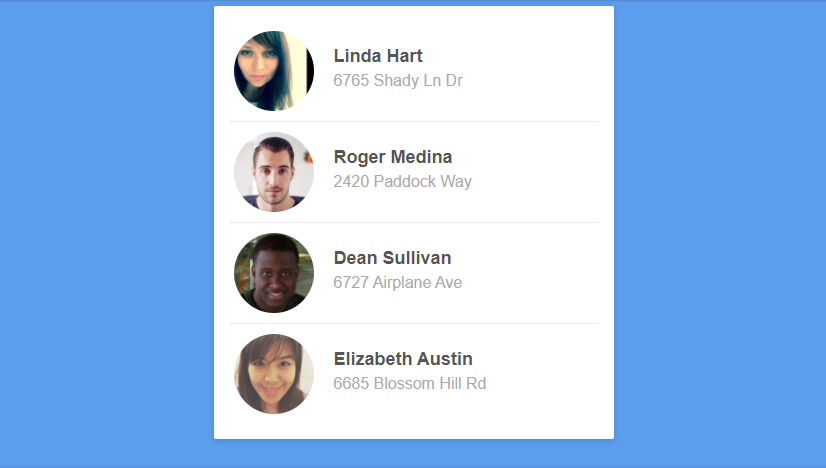

# Aula 17 - Mesa de trabalho

## Proposta

Estimular a prática de conceitos abordados em **Flexbox** e **Grid Layout**.

## Instrução

Com base na imagem e o código-fonte: 

- [ ] Implemente, utilizando a linguagem CSS, um Clone componete a seguir.

 

## Recursos

- [ ] [Código-fonte da atividade](./codigo-fonte.zip);